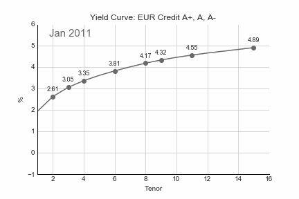
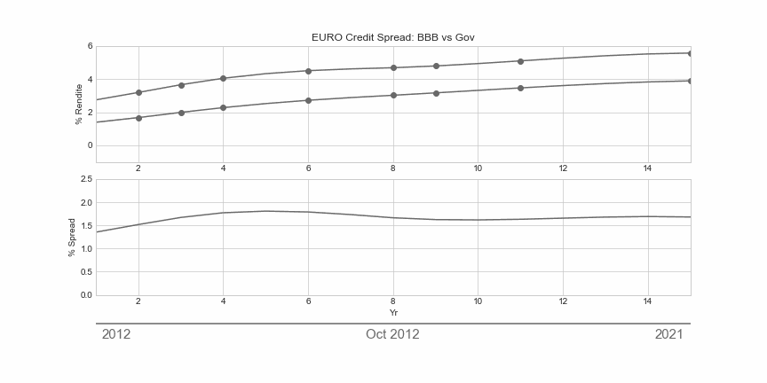

# Data Visualization

## Animated Line Plot

The plot below shows month-end values of the Euro Corporates Yield Curve (BVAL) in the rating range of A+, A, and A- over time. In order to compare the most recent curve to its historical pendents, every curve leaves a shade of itself.

The generating code is located [here](anim_yieldCurve/EUR_yld.py).

## Animated Spread Plot

The animated spread plot is designed to display the dynamics of a spread between two curves. 

